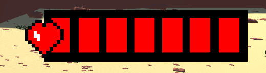
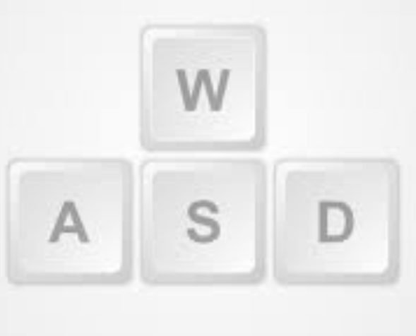
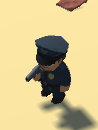
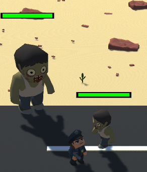
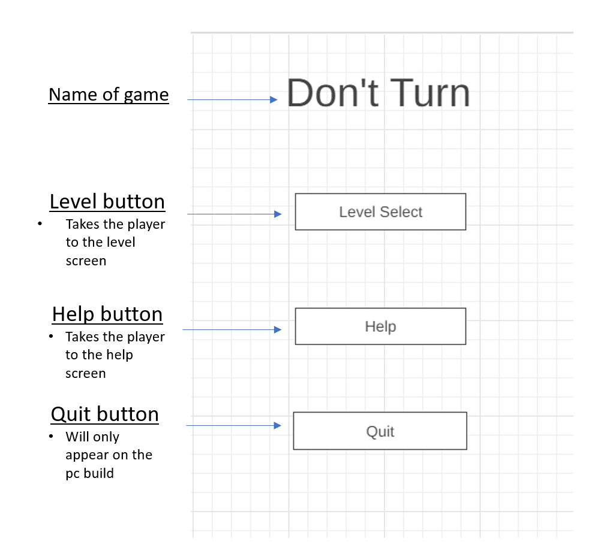
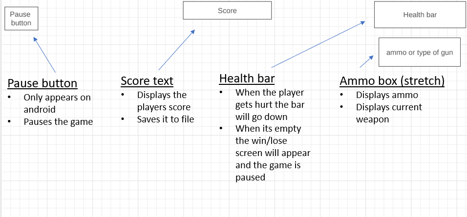
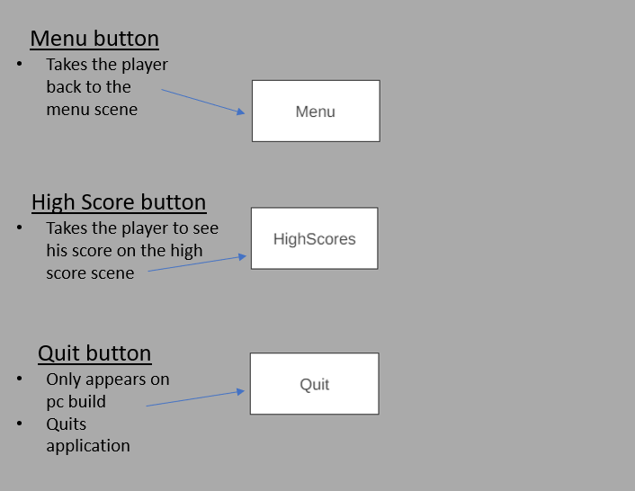
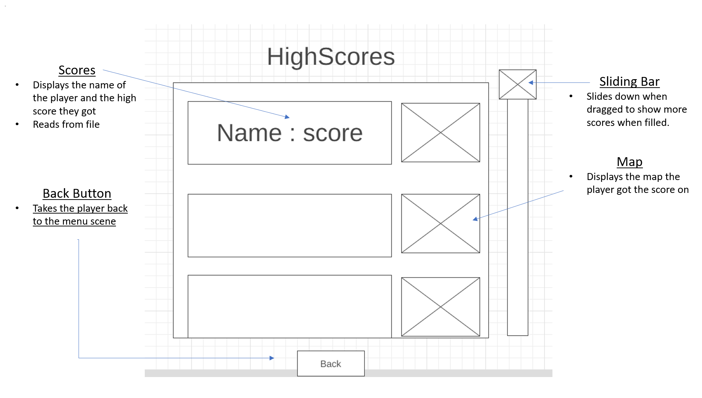

# Game Design Pitch

- You find youself surrounded by zombies after responding to a call, 
Will you use your gun and survive as long as possible, or will you fall and turn?
 
## Working Title
Dont Turn

## Concept statement  
- Dont Turn will be a zombie survival, you will face wave after wave of zombies pushing your skills.

## Target audience  
- Age: 8-15, Gender: Male, relevent interests: zombie survival, bird eye view shooter. 

## Reference
- A simular game is many top down shooter games but the closest is Box Head zombie wars.

## Player experience and game POV 
 
- I want the player to feel strong and powerful but after a couple minutes feel rushed and paniced.  
At first the zombies are slow and easy to kill. After a while you start feeling  more rushed because you dont have time to sit still.

- The point of view is bird like.

## Unique Selling Points

-My game will stand out to those who love zombie games and survival type games.

## Genre(s) 

-zombie survival shooter.

## Platform(s) and primary technology 

- PC, mobile and Web, 3D Unity.

## Visual/audio Style 
The look and feel of my game im going for is an arcade shooter, a low poly cartoon vibe.
the expience i want to player to feel is to be stronger then the enemys and only losing because they made a bad judgment in movement.

some Screen shoots i can show are gameplay and the players health.

## Game Systems
What systems are needed to make this game? Which ones are internal (simulation, etc.) and which does the player interact with? 

- Spawning - Enemies have a grave system that appears in a random location around the map, by default the grave spawns a zombie after one seccond and then gets destroyed.

- Progressively harder - The grave over time makes the movement of zombies faster, spawn faster and their animations faster.

- CrossPlatform controls - I have virtual joysticks that are disabled by default

On windows the player moves with the keyboard and mouse but only on android 2 joysticks appear and control the players movement and rotation.

- OnCollison Triggers - When the bullet prefab enters the zombies colision, damage is dealt - when the zombie enters the players radius/colision dmage is dealt imediately and collisian stay function allows damage to be dealt over time if the player is still in the radius of the zombie.

- health bar - both enemies and the player have a health bar, when the bullet collides with the zombies a function is called and takes in a value and deal 'damage' to the health bar. ive added a gradient to the bar so the lower the health the more red it gets.

## Interactivity

- Movement android
On android the player has a thumbstick to move around the map 

- Movement pc and web
on pc and web builds the player uses the keyboard to move around the map

- Shooting phone

the player uses the joystick to shoot

- shooting pc
the player uses the left click button to shoot by default

# Entities

 The Player
  - Moves around the screen based on the input by the user
  - base movement speed is 1;
  - Gets hurt when in contact with zombies
  - shoots bullets with either mouse or thumbstick
  - has a health bar when it reaches 0 the game is over

  - 24 health
  - speed is 1
  - base damage is 10
 

 The small zombie
 - has 50 health
 - speed is at 0.8
 - damage is 4 which is 1 bar of health
 - size is 0.9

The Big Zombie
- has 100 health
- speed is 0.6
- damage is 8 which is 2 bars of health
- size is 2.5

PowerUps

- health
 Heals player 

## Game UI:
- menu concept/wireframe

- game ui concept/wireframe

- gameover/win concept/wireframe

- highscores concept/wireframe

